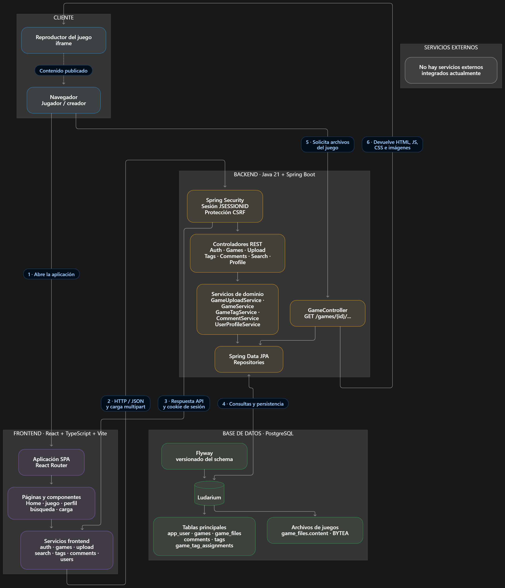

# Architecture




The application follows a simple split architecture: a React app for the storefront and a Spring Boot app for the catalog and static asset delivery.

## The big picture

```text
┌──────────────────────────────────────────────────────────┐
│  Browser — React 19 SPA (Vite dev server, :5173)          │
│                                                          │
│  pages/ ──► services/ ──► fetch(API_BASE_URL)             │
│  components/comments · games · navbar · profile          │
└────────────────────────┬─────────────────────────────────┘
                         │  credentials: "include"
                         │  X-CSRF-TOKEN on writes
                         ▼
┌──────────────────────────────────────────────────────────┐
│  Spring Boot 4.1.1 (:8080)                               │
│                                                          │
│  SecurityFilterChain ── session + CSRF + CORS            │
│        │                                                 │
│  controller/  ──►  Service  ──►  Repository ──►  JPA    │
│  (HTTP shape)     (rules)        (queries)               │
│        │                                                 │
│  GameController ──────────────► game_files (bytea)       │
└────────────────────────┬─────────────────────────────────┘
                         ▼
              PostgreSQL 16 (Flyway migrations)
```

Two request families, with different shapes:

- `/api/**` returns JSON and goes through the service layer (except the catalog and search,
  see [Known Issues](Known-Issues.md)).
- `/games/{gameId}/**` returns raw bytes straight from the database and bypasses the services
  entirely.

## Backend package layout

Base package: `com.tip_video_ludoteca`. Note there is **no** `.backend` segment — the group id
is `com.tip-video-ludoteca` but the Java package uses underscores.

```text
com/tip_video_ludoteca/
  BackendApplication.java   @SpringBootApplication

  auth/
    AuthController          register, login, me, csrf  (logout lives in SecurityConfig)

  comments/
    Comment                 entity
    CommentRepository       two ordering queries, @EntityGraph on author
    CommentService          create, createReply, listByGame
    CommentResponse         nested DTO, static factory + withReplies
    CreateCommentRequest    @NotBlank @Size(max=1000), @Min(1) @Max(5) rating
    CreateReplyRequest      same, rating must be null
    CommentNotFoundException
    InvalidCommentException

  config/
    SecurityConfig          password encoder, CORS delegation, filter chain
    WebConfig               the single CORS configuration
    GlobalExceptionHandler  maps domain exceptions to {"error": "..."}
    DevDataSeeder           @Profile("dev"), idempotent seed

  controller/
    GameApiController       GET /api/games  (paginated catalog)
    GameUploadController    POST /api/games, POST /api/games/{id}/publish
    GameCoverController     GET /api/games/{id}/cover
    GameController          GET /games/{id}/**  (raw bytes)
    CommentApiController    comments and replies
    ProfileApiController    public profile and description
    AuthController -> auth/

  games/
    Game                    entity: id, owner, title, description, coverImageUrl,
                            entryFile, status, createdAt
    GameFile                entity with @EmbeddedId GameFileId
    GameFileId              embeddable composite key (gameId, path)
    GameRepository, GameFileRepository
    GameService             publish(), with the ownership check
    GameUploadService       ZIP extraction, validation, persistence
    GameStatus              DRAFT, PUBLISHED
    GameNotFoundException, GameEditForbiddenException

  search/
    SearchController        GET /api/search  (games + users in one call)

  users/
    User                    entity: id, username, email, passwordHash,
                            description, profileImageUrl, createdAt
    UserRepository
    UserProfileService      getProfile, updateDescription
    UserProfileResponse, UpdateDescriptionRequest
    UserNotFoundException, ProfileEditForbiddenException
    DatabaseUserDetailsService  loads by email, grants ROLE_USER
```

On `feature/tags` there is also a `tags/` package. See [Tags](Tags.md).

## Layering convention

The intended flow, used by comments, games and profiles:

```text
Controller  ->  Service  ->  Repository  ->  Entity
 (HTTP)        (rules,     (queries)
                transactions,
                ownership)
```

`GameApiController` and `SearchController` break it by injecting repositories directly. Both
are read-only and self-contained, which is why the deviation is survivable, but it is the main
thing to be aware of when adding a feature: **follow the service pattern**, because that is
where the ownership rules and the transactions live.

### Ownership is not done by Spring Security

There is one authority, `ROLE_USER`, and no `@PreAuthorize` anywhere. "Only the owner may do
this" is hand-written in the service:

```java
if (!game.getOwner().getId().equals(user.getId())) {
    throw new GameEditForbiddenException();
}
```

and, for profiles, by comparing usernames:

```java
if (!user.getUsername().equalsIgnoreCase(username)) {
    throw new ProfileEditForbiddenException();
}
```

Two consequences:

- The service needs the caller's identity as a **plain string** (`userEmail`), not an
  `Authentication` object. That is what makes the services unit-testable without Spring.
- A new "only the author may edit their comment" rule would be a third instance of the same
  manual check.

## Request flows

### Reading the catalog

```text
Home.tsx
  -> services/gameService.getGamesPage(page)
  -> GET /api/games?page=0&size=12
  -> GameApiController.getGames()
       clamps page >= 0, clamps size to 1..24
  -> GameRepository.findByStatus(PUBLISHED, PageRequest.of(page, size, createdAt DESC))
  -> GamePage record
  <- image "/api/games/{id}/cover" resolved to an absolute URL by the frontend
```

Only `PUBLISHED` games are ever returned. A draft is invisible to the catalog, to search and
to the player.

### Playing a game

```text
Game.tsx builds  ${API_BASE_URL}/games/{gameId}/index.html
  -> GameController.getGameFile(gameId, request)
       decodes the URI, strips "{contextPath}/games/{gameId}/"
       normalizes the remainder, rejects blank / absolute / ".." paths
  -> GameFileRepository.findById_GameIdAndId_Path(gameId, path)
  -> 200 with the stored content type + X-Content-Type-Options: nosniff
```

The lookup is keyed by **both** the game id and the path, so a request for game A can never
return a row belonging to game B.

This works from a cross-origin iframe because `SecurityConfig` relaxes the framing headers:

```java
.frameOptions(frame -> frame.disable())
.contentSecurityPolicy(csp -> csp
    .policyDirectives("frame-ancestors 'self' " + frontendOrigin))
```

### Uploading and publishing

```text
UploadGame.tsx
  -> gameUploadService.uploadGame(...)  POST /api/games (multipart)
  -> GameUploadService.upload()
       validates the cover by magic bytes
       extracts the ZIP entry by entry, rejecting traversal and oversized entries
       requires index.html at the root
       INSERT games (status = DRAFT)
       INSERT one game_files row per entry + one for the cover
  -> 201 { id, title, filesStored }
  <- the user presses "Publish game"
  -> GameService.publish(gameId, userEmail)   ownership check, status = PUBLISHED
```

The whole upload is one transaction. See [Game Upload](Game-Upload.md).

### Writing a comment

```text
CommentSection -> useComments -> commentService.createComment(...)
  -> POST /api/games/{gameId}/comments
  -> CommentService.create()
       author comes from the security context, never from the body
       validates content and rating
  -> CommentRepository.save()
  <- the frontend re-reads the whole thread
```

The one-level nesting rule lives in the entity:

```java
public boolean isRoot() {
    return parentComment == null;
}

public Comment rootComment() {
    return parentComment == null ? this : parentComment;
}
```

`CommentService.createReply` stores the new reply against `target.rootComment()`, so the
stored tree can never exceed one level regardless of what the client posts. `useComments` then
re-fetches the whole list after any write, which is why the frontend always agrees with the
server about ordering.

### Listing comments

Two queries, two orderings, one response:

```java
findByGame_IdAndParentCommentIsNullOrderByCreatedAtDescIdDesc(gameId)  // roots, newest first
findByGame_IdAndParentCommentIsNotNullOrderByCreatedAtAscIdAsc(gameId) // replies, oldest first
```

`CommentResponse.from(comment, game, isGameAuthor)` computes the author flag by comparing the
comment's author with the game owner, and `withReplies(...)` nests the second list under the
first. The `email` and the password hash are never mapped into the DTO, and
`CommentApiControllerTests` asserts their absence.

## Error handling

### The domain exception table

`config/GlobalExceptionHandler.java` is a `@RestControllerAdvice` with one body shape:

```json
{ "error": "El juego no existe." }
```

| Exception | Status | Message |
| --- | --- | --- |
| `UserNotFoundException` | 404 | `Usuario no encontrado.` |
| `GameNotFoundException` | 404 | `El juego no existe.` |
| `CommentNotFoundException` | 404 | `El comentario no existe.` |
| `InvalidCommentException` | 400 | the exception's own message |
| `ProfileEditForbiddenException` | 403 | `No podés editar el perfil de otro usuario.` |
| `GameEditForbiddenException` | 403 | `No podés publicar el juego de otro usuario.` |
| `MethodArgumentNotValidException` | 400 | the first field error's default message, else `La solicitud no es válida.` |
| `HttpMessageNotReadableException` | 400 | `El cuerpo de la solicitud no es válido.` |

All the exception classes extend `RuntimeException`.

### Security failures

Handled separately, and not with the same shape — see
[Authentication](Authentication.md#error-responses):

| Situation | Status | Body |
| --- | --- | --- |
| No session on a protected route | 401 | empty |
| Session but not the owner | 403 | `{"error":"No tenés permiso para realizar esta acción."}` |

### The gap

`ResponseStatusException` — thrown by `GameUploadService` and, on `feature/tags`,
`GameTagService` — is **not** in the table. Spring renders it as a `ProblemDetail`:

```json
{ "type": "...", "status": 400, "error": "Bad Request", "detail": "Choose a ZIP file." }
```

So the API currently has two error shapes. `services/gameUploadService.ts` reads `detail`
first to cope; `services/searchService.ts` still only reads `error`. Adding one
`@ExceptionHandler(ResponseStatusException.class)` would close it. Listed in
[Known Issues](Known-Issues.md).

## Frontend architecture

See [Frontend](Frontend.md) for the full picture. The two points that matter here:

**No global state.** There is no Context, no Redux, no React Query — zero occurrences of
`createContext` or `Provider` in `src/`. Each page owns its data with `useState` and fetches it
on mount, including the current user, which several pages request independently.

**One HTTP layer.** `src/services/` is the only place that calls `fetch`. Components never
touch the network directly. `api.ts` owns the base URL, the CSRF prefetch and the error
parser.

## Cross-cutting decisions

| Decision | Why | Consequence |
| --- | --- | --- |
| Game files as `bytea` rows | a single indexed lookup per asset; `ON DELETE CASCADE` removes the assets with the game; no filesystem to provision or keep in sync | every asset read is a database round trip, and a 100 MB upload needs ~100 MB of heap |
| `UUID` primary keys for games | ids are generated by the application, so an upload does not need a round trip to learn its id | ids are opaque 36-character strings in URLs |
| The cover is a row, not a column | `GameCoverController` reuses the same repository and serving path as the game files | the reserved path `__metadata__/thumbnail` must be rejected in uploaded ZIPs |
| Sessions, not JWT | the game files and the catalog are public; there is no third-party API consumer | the frontend must send cookies, which forces CORS with `allowCredentials(true)` and forbids a wildcard origin |
| CSRF fetched per write | the token is bound to the session, and there is no app-level bootstrap | the prefetch is duplicated in five services |
| Content type sniffed at upload and replayed | the served type is decided once, from the extension or the cover's magic bytes | a malformed stored type would raise `InvalidMediaTypeException`, which nothing handles |
| Hand-enforced ownership | services take a plain `userEmail`, so they test without Spring | the same check is written out in every service instead of being declarative |
| `open-in-view=false` | no lazy loading outside a transaction | services must fetch eagerly inside their `@Transactional` methods |

## Where to add a feature

| Change | Where |
| --- | --- |
| A new endpoint | a controller in `controller/`, plus a service if it has rules |
| A new query | a method on the relevant `*Repository` |
| A new rule that must hold | the service, wrapped in `@Transactional` |
| A new table or column | a new `V<n>__...sql` migration, plus the entity field |
| A new page | `pages/`, plus a route in `App.tsx` and an entry in `_Sidebar`-style nav |
| A new API call | `services/`, then a hook or component state |
| Anything stored as bytes | `games/GameUploadService`, with a limit and a validation rule |

## Related

- [API](API.md) — the endpoints these flows expose
- [Database](Database.md) — schema and entities
- [Authentication](Authentication.md) — the filter chain in detail
- [Frontend](Frontend.md) — routing, services and styling
- [Known Issues](Known-Issues.md) — where the architecture deviates from its own conventions